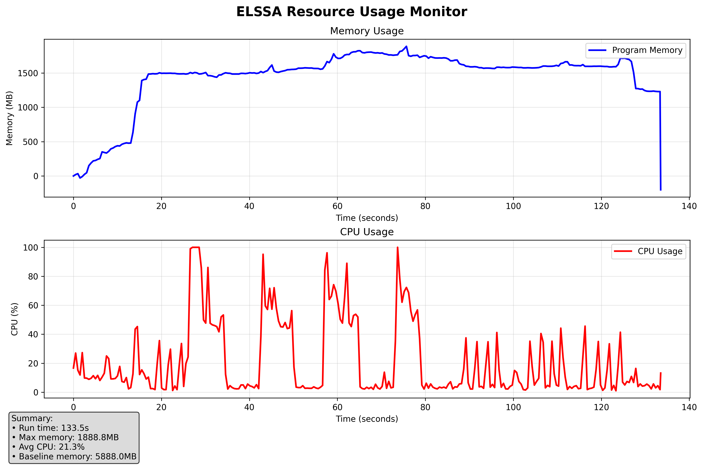

# E.L.S.S.A - Even Lowkey, Still Superior Assistant

## Introduction

E.L.S.S.A is a powerful AI voice assistant with advanced speech processing, multiple LLM support, and a modular design, enabling natural voice interaction. But what's truly impressive? It runs entirely locally, even on CPU!

## Technologies Used

### Core AI & Speech Processing
- **Speech Recognition**: Whisper (via whispercpp) for accurate real-time speech-to-text conversion
- **Wake Word Detection**: OpenWakeWord for hands-free voice activation and interrupt handling
- **Text-to-Speech**: Dual engine support with OpenVoice (voice cloning) and CoquiTTS (neural vocoders)
- **Large Language Models**: llama-cpp-python with support for Llama, Phi, and other GGUF quantized models
- **Voice Cloning**: OpenVoice technology for custom voice synthesis and speaker adaptation

### Audio & Signal Processing
- **Audio Management**: PyAudio and SoundDevice for cross-platform audio input/output handling
- **Real-time Processing**: NumPy-based audio buffer management with configurable chunk processing
- **Streaming Audio**: Real-time TTS streaming with interrupt management and fade transitions
- **Multi-threading**: Concurrent audio processing for responsive voice interactions

### AI Framework & Architecture
- **Agentic Reasoning**: Tool-based AI agent capabilities
- **Context Management**: Smart conversation context tracking with configurable memory limits
- **Plugin System**: Three-layer architecture (Voice Interface, Reasoning, Plugins) for extensibility
- **Configuration Management**: YAML-based flexible configuration system for all components

### Development & Performance
- **Async Programming**: AsyncIO for non-blocking operations and improved responsiveness
- **Model Optimization**: GGUF quantization support for efficient CPU/GPU inference
- **Fuzzy Matching**: FuzzyWuzzy with Levenshtein distance for robust text processing
- **Package Management**: UV-compatible requirements for fast dependency resolution

## Performance

E.L.S.S.A demonstrates excellent resource efficiency while running entirely on local hardware:



### Resource Usage Benchmarks

## Installation Guide

### 1. Create a Python Virtual Environment

Use [uv](https://github.com/astral-sh/uv) to create a virtual environment with Python 3.10.12:

```bash
uv venv elssa --python=3.10.12
source elssa/bin/activate
```

### 2. Install Dependencies

Install all required Python packages from `requirements.txt`:

```bash
uv pip install -r requirements.txt
```

### 3. Download OpenVoice Checkpoints

Download the sample checkpoint for OpenVoice:

```bash
mkdir -p libs/openvoice

wget -O libs/openvoice/checkpoints_1226.zip \
  https://myshell-public-repo-host.s3.amazonaws.com/openvoice/checkpoints_1226.zip

unzip libs/openvoice/checkpoints_1226.zip -d libs/openvoice

rm libs/openvoice/checkpoints_1226.zip

```

### 4. Choose a LLM

#### 4.1. Phi-2

```bash
# Manually download the model and run with local path
huggingface-cli download TheBloke/phi-2-GGUF --local-dir models/phi-2
```

#### 4.2. Llama-3.2-3B-Instruct

```bash
wget https://huggingface.co/bartowski/Llama-3.2-3B-Instruct-GGUF/resolve/main/Llama-3.2-3B-Instruct-IQ3_M.gguf -P models/Llama-3.2-3B-Instruct/
```

## Usage

Run the main application:

```bash
python main.py
```

The system will initialize all components and wait for wake word activation. Speak the configured wake word to start interacting with E.L.S.S.A.

## Notes

- Make sure you have [uv](https://github.com/astral-sh/uv) and Python 3.10.12 installed on your system.

- If you encounter permission issues when cloning OpenVoice, check your SSH keys or use HTTPS instead of SSH.

- Configure audio devices and model parameters in `config.yaml` according to your hardware setup.

---

Happy installing and enjoy using E.L.S.S.A!
