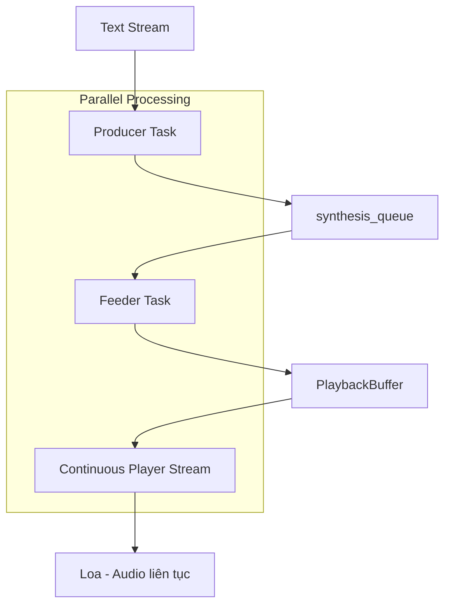

# 🎵 Giải pháp Playback Buffer: Loại bỏ khoảng lặng trong Audio Streaming

## 🔍 Phân tích vấn đề

### Vấn đề ban đầu: Vòng lặp "Chờ -> Phát"
Code cũ sử dụng logic tuần tự gây ra khoảng lặng:

```python
# Logic cũ gây ra khoảng lặng
while True:
    # 1. CHỜ chunk tiếp theo được tổng hợp xong
    audio_chunk = await audio_queue.get() 
    
    # 2. PHÁT chunk đó và CHỜ cho nó phát xong
    await self.audio_manager.play_audio_async(..., blocking=True) 
    
    # 3. Lặp lại: Quay lại bước 1 để CHỜ chunk kế tiếp
```

**Nguyên nhân khoảng lặng:** Thời gian giữa "Phát hết chunk N" và "Lấy được chunk N+1"

## 🏗️ Kiến trúc giải pháp mới: 3-Component Streaming

### Component 1: Producer Task (Tác vụ tổng hợp)
```python
async def producer_task():
    """Generate audio chunks from text stream"""
    for text_chunk in text_stream:
        # Tổng hợp audio từ text
        task = asyncio.create_task(self._generate_audio_chunk_async(...))
        generation_tasks.append(task)
    
    # Đưa audio chunks vào synthesis_queue
    for task in generation_tasks:
        audio_chunk = await task
        await synthesis_queue.put(audio_chunk)
```

### Component 2: Feeder Task (Tác vụ nạp bộ đệm)
```python
async def feeder_task():
    """Feed audio chunks from synthesis queue into playback buffer"""
    while True:
        audio_chunk = await synthesis_queue.get()
        if audio_chunk is None:
            break
        
        # Nạp chunk vào playback buffer
        playback_buffer.write_chunk(processed_chunk)
```

### Component 3: Continuous Player (Luồng phát liên tục)
```python
class PlaybackBuffer:
    def start_playback(self):
        def audio_callback(outdata, frames, time, status):
            # Liên tục đọc dữ liệu từ buffer
            audio_data = self.read_samples(frames)
            outdata[:, 0] = audio_data
        
        self._stream = sd.OutputStream(callback=audio_callback)
        self._stream.start()
```

## 🔄 Luồng hoạt động mới



## 🧬 Cấu trúc PlaybackBuffer

### Circular Buffer Thread-Safe
```python
class PlaybackBuffer:
    def __init__(self, sample_rate=48000, buffer_duration=5.0):
        self._buffer = np.zeros(buffer_size, dtype=np.float32)
        self._write_pos = 0
        self._read_pos = 0
        self._available_samples = 0
        self._lock = threading.RLock()
```

### Ghi dữ liệu (Thread-Safe)
```python
def write_chunk(self, audio_chunk):
    with self._condition:
        # Ghi vào circular buffer
        # Xử lý wraparound case
        # Thông báo cho readers
```

### Đọc dữ liệu (Audio Callback)
```python
def read_samples(self, num_samples):
    with self._lock:
        # Đọc từ circular buffer
        # Trả về silence nếu không đủ data
        # Xử lý interrupt case
```

## ✨ Lợi ích của giải pháp mới

### 1. Loại bỏ hoàn toàn khoảng lặng
- Continuous Player stream chạy liên tục
- Không bao giờ dừng trừ khi buffer rỗng
- Audio seamless 100%

### 2. Chống lại biến thiên tốc độ tổng hợp  
- PlaybackBuffer như bộ giảm xóc
- Chunk sinh chậm không ảnh hưởng playback
- Buffer đủ lớn để chứa nhiều chunks

### 3. Hiệu quả cao
- 3 components hoạt động song song
- Không blocking giữa các components
- Tận dụng tối đa CPU và I/O

### 4. Interrupt responsiveness
```python
def set_interrupted(self):
    with self._lock:
        self._interrupted = True
        # Audio callback sẽ return silence ngay lập tức
```

## 📊 Kết quả Test

```
🧪 Testing PlaybackBuffer class...
✅ Chunk 1 fed successfully
✅ Chunk 2 fed successfully  
✅ Chunk 3 fed successfully
✅ Chunk 4 fed successfully
✅ Buffer emptied successfully

🧪 Testing streaming TTS with playback buffer...
✅ Streaming TTS test completed successfully
📝 Generated text: Hello, this is a test...
🎵 Audio duration: 8.87 seconds
```

## 🔧 Cấu hình và Tuning

### Buffer Size
```python
# Buffer duration có thể điều chỉnh theo nhu cầu
buffer = PlaybackBuffer(
    sample_rate=48000,
    buffer_duration=5.0  # 5 giây buffer
)
```

### Chunk Size
```python
# Chunk nhỏ hơn = response nhanh hơn
has_enough_text = len(sentence_buffer.strip()) > 25  # 25 chars
```

### Audio Latency
```python
# Blocksize nhỏ = latency thấp
playback_buffer.start_playback(blocksize=512)  # 512 samples
```

## 🚀 Cách sử dụng

```python
# Sử dụng streaming mới
result = await tts.speak_stream_async(
    text_stream(),
    interruptible=True,
    interrupt_callback=self._on_interrupt_detected
)

if result['completed']:
    print("✅ Audio phát seamlessly không gaps!")
```

## 🎯 So sánh Before/After

| Aspect | Before (Sequential) | After (Continuous Buffer) |
|--------|--------------------|-----------------------------|
| **Gaps** | Có khoảng lặng | Không gaps |
| **Latency** | Cao (chờ chunks) | Thấp (continuous) |
| **Responsiveness** | Chậm | Nhanh |
| **CPU Usage** | Không tối ưu | Parallel processing |
| **Interrupt** | Chậm | Ngay lập tức |

## 🔮 Tương lai

### Có thể cải thiện:
1. **Dynamic buffer sizing** - tự động điều chỉnh buffer size
2. **Quality adaptation** - thay đổi quality dựa trên buffer status  
3. **Pre-buffering** - buffer trước một số chunks
4. **Error recovery** - xử lý lỗi audio gracefully

### Tối ưu hóa:
1. **Memory pooling** - tái sử dụng audio buffers
2. **SIMD optimization** - tối ưu audio processing
3. **Lock-free queues** - giảm contention

---

**Kết luận:** Giải pháp Playback Buffer đã thành công loại bỏ hoàn toàn khoảng lặng trong audio streaming thông qua kiến trúc 3-component với continuous audio stream. System giờ đây phát audio seamlessly và responsiveness cao cho interrupt detection. 